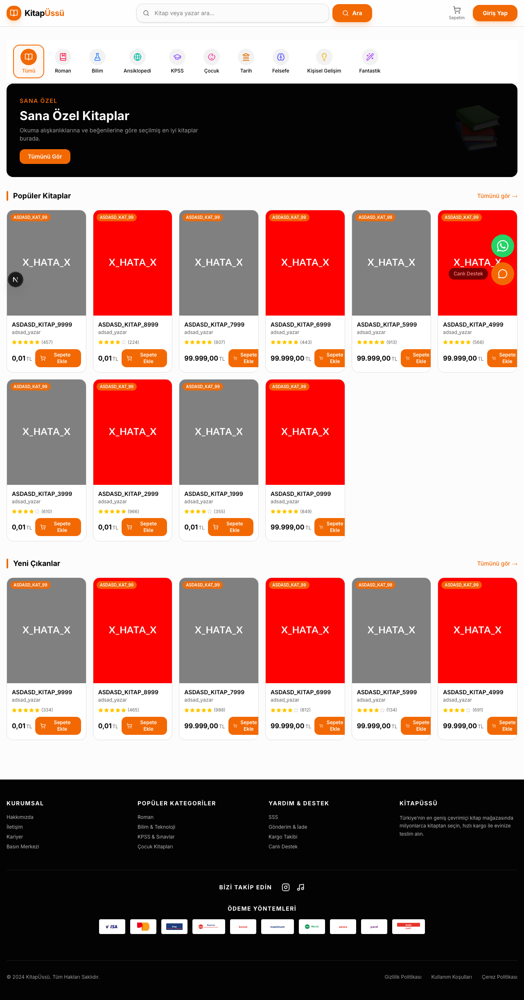
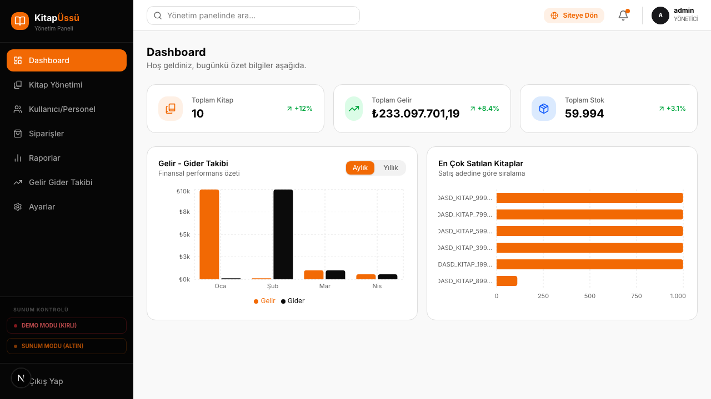
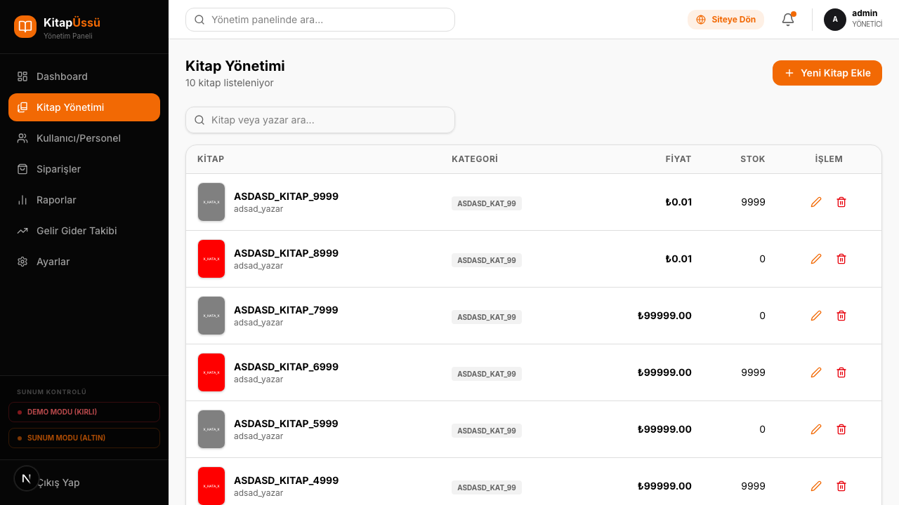

<div align="center">
  <h1>KİTAPÜSSÜ</h1>
  <p><strong>Kitap Yönetim ve Satış Sistemi</strong></p>
</div>

---

## Proje Hakkında

KitapÜssü, modern bir e-ticaret kitap satış platformu ve kapsamlı bir yönetim panelini içeren tam donanımlı bir web uygulamasıdır. Proje; dinamik içerik yönetimi, kullanıcı deneyimi odaklı tasarım, canlı destek entegrasyonu ve güvenli ödeme süreçleri üzerine kurgulanmıştır.

Sistem iki ana modülden oluşmaktadır:
1. **Kullanıcı Paneli:** Kitap listeleme, gelişmiş arama, sepet yönetimi ve profesyonel ödeme ekranı.
2. **Yönetici (Admin) Paneli:** Kitap/kategori yönetimi ve satış istatistikleri.

Ayrıca platformda akıllı yönlendirmeler sunan bir Canlı Destek Botu bulunmaktadır.

## Teknoloji Paketi (Tech Stack)

Proje, güncel ve performanslı bir teknoloji yığını ile geliştirilmiştir. Aşağıdaki tabloda projede kullanılan temel teknolojiler listelenmiştir:

| Kategori | Teknolojiler |
| :--- | :--- |
| **Frontend Framework** | Next.js 16 (App Router) |
| **UI & Bileşenler** | React 19, TypeScript, Radix UI |
| **Stil & Tasarım** | Tailwind CSS 4, Lucide React (İkonlar) |
| **Veritabanı & ORM** | MySQL, Prisma ORM |
| **Durum Yönetimi** | React Context API & Custom Hooks |
| **Form & Doğrulama** | React Hook Form, Zod |

## Ekran Görüntüleri

Aşağıdaki tabloda projenin farklı modlarına ve panellerine ait ekran görüntülerini inceleyebilirsiniz:

<table align="center">
  <tr>
    <td align="center">
      <strong>Ana Sayfa</strong><br/>
      
    </td>
    <td align="center">
      <strong>Demo Modu (Kirli Veriler)</strong><br/>
      
      <br/><em>Test süreçlerini göstermek amacıyla sistemi "kirli" verilerle dolduran mod (Cmd/Ctrl + Shift + D ile erişilebilir).</em>
    </td>
  </tr>
  <tr>
    <td align="center">
      <strong>Admin Paneli - Dashboard</strong><br/>
      
    </td>
    <td align="center">
      <strong>Admin Paneli - Kitap Yönetimi</strong><br/>
      
    </td>
  </tr>
</table>

## Kurulum ve Çalıştırma

Projeyi kendi ortamınızda çalıştırmak için aşağıdaki adımları izleyebilirsiniz:

1. **Projeyi Klonlayın:**
   ```bash
   git clone https://github.com/okutaybozkurt/bookflow-management-system.git
   ```

2. **Bağımlılıkları Yükleyin:**
   ```bash
   npm install
   ```

3. **Veritabanı Yapılandırması:**
   `.env` dosyasındaki `DATABASE_URL` bilgisini yerel MySQL veritabanı ayarlarınıza göre güncelleyin.

4. **Veritabanını Hazırlayın:**
   ```bash
   npx prisma db push
   ```

5. **Uygulamayı Başlatın:**
   ```bash
   npm run dev
   ```

Tarayıcınızdan [http://localhost:3000](http://localhost:3000) adresine giderek sistemi kullanmaya başlayabilirsiniz.
