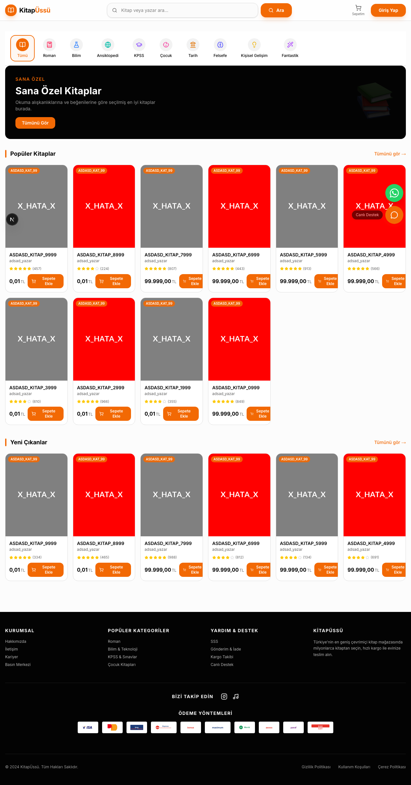
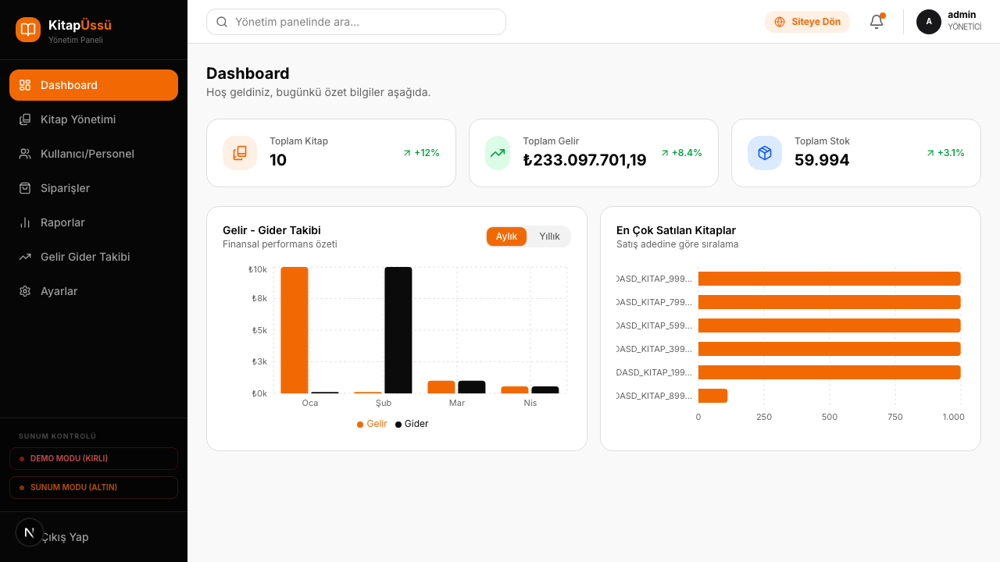
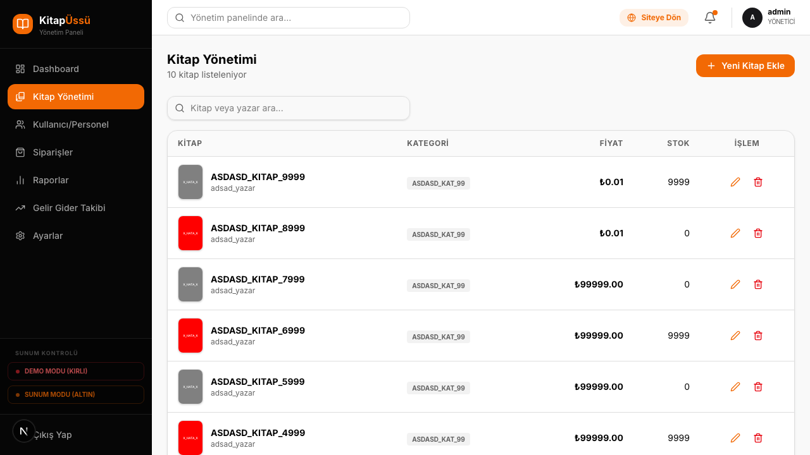

<div align="center">
  <h1>KİTAPÜSSÜ</h1>
  <p><strong>Kitap Yönetim ve Satış Sistemi</strong></p>
</div>

---

## Proje Hakkında

KitapÜssü, modern bir e-ticaret kitap satış platformu ve kapsamlı bir yönetim panelini içeren tam donanımlı bir web uygulamasıdır. Proje; dinamik içerik yönetimi, kullanıcı deneyimi odaklı tasarım, canlı destek entegrasyonu ve güvenli ödeme süreçleri üzerine kurgulanmıştır.

Sistem iki ana modülden oluşmaktadır:
1. **Kullanıcı Paneli:** Kitap listeleme, gelişmiş arama, sepet yönetimi ve profesyonel ödeme ekranı.
2. **Yönetici (Admin) Paneli:** Kitap/kategori yönetimi ve satış istatistikleri.

Ayrıca platformda akıllı yönlendirmeler sunan bir Canlı Destek Botu bulunmaktadır.

## Teknoloji Paketi (Tech Stack)

Proje, güncel ve performanslı bir teknoloji yığını ile geliştirilmiştir. Aşağıdaki tabloda projede kullanılan temel teknolojiler listelenmiştir:

| Kategori | Teknolojiler |
| :--- | :--- |
| **Frontend Framework** | Next.js 16 (App Router) |
| **UI & Bileşenler** | React 19, TypeScript, Radix UI |
| **Stil & Tasarım** | Tailwind CSS 4, Lucide React (İkonlar) |
| **Veritabanı & ORM** | MySQL, Prisma ORM |
| **Durum Yönetimi** | React Context API & Custom Hooks |
| **Form & Doğrulama** | React Hook Form, Zod |

## Ekran Görüntüleri

Aşağıdaki tabloda projenin farklı modlarına ve panellerine ait ekran görüntülerini inceleyebilirsiniz:

<table align="center">
  <tr>
    <td align="center">
      <strong>Ana Sayfa</strong><br/>
      
    </td>
    <td align="center">
      <strong>Demo Modu (Kirli Veriler)</strong><br/>
      
      <br/><em>Test süreçlerini göstermek amacıyla sistemi "kirli" verilerle dolduran mod (Cmd/Ctrl + Shift + D ile erişilebilir).</em>
    </td>
  </tr>
  <tr>
    <td align="center">
      <strong>Admin Paneli - Dashboard</strong><br/>
      
    </td>
    <td align="center">
      <strong>Admin Paneli - Kitap Yönetimi</strong><br/>
      
    </td>
  </tr>
</table>

## Mimari

Proje, birbirinden bağımsız iki uygulamadan oluşur ve yalnızca HTTP/JSON (REST API) üzerinden haberleşir:

```
backend/    Laravel 13 REST API  (PHP 8.3+, MySQL, Laravel Sanctum)
frontend/   React (Next.js) arayüzü
docs/       ER diyagramı, MySQL şeması, mimari notlar
```

- Veritabanı mimarisi ve ER diyagramı: [docs/ER-DIYAGRAMI.md](docs/ER-DIYAGRAMI.md)
- Kod mimarisi, SOLID ve tasarım desenleri: [docs/MIMARI.md](docs/MIMARI.md)

> **Geçiş durumu:** Backend (Laravel) veri modeli tamamlandı. Frontend şu an eski Next.js/Prisma API'sini kullanıyor; Laravel API'sine bağlanması bir sonraki aşamalardadır.

## Backend Kurulumu (Laravel + MySQL)

Gereksinimler: PHP 8.3+, Composer, MySQL 8 (macOS: `brew install php composer mysql`).

```bash
mysql -u root -p -e "CREATE DATABASE bookflow CHARACTER SET utf8mb4 COLLATE utf8mb4_unicode_ci"

cd backend
composer install
cp .env.example .env          # DB_USERNAME / DB_PASSWORD değerlerini düzenleyin
php artisan key:generate
php artisan migrate
php artisan test              # testleri çalıştırır
php artisan serve             # http://localhost:8000
```

## Frontend Kurulumu (geçici)

```bash
cd frontend
npm install
npm run dev                   # http://localhost:3000
```
