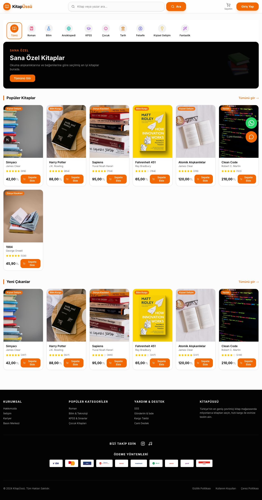

<div align="center">
  <h1>KİTAPÜSSÜ</h1>
  <p><strong>Kitap Yönetim ve Satış Sistemi</strong></p>
</div>

---

## Proje Hakkında

**BookFlow – Kitap Satış ve Stok Yönetim Platformu**, çevrimiçi kitap satışı ve stok yönetimi için geliştirilmiş bir web uygulamasıdır. Müşteriler kitapları arayıp favorilerine ekler, yorum yapar ve sipariş verir; yöneticiler kitap, stok, kullanıcı ve siparişleri yönetir, satış raporlarını izler.

Uygulama birbirinden bağımsız iki katmandan oluşur ve yalnızca HTTP/JSON (REST API) ile haberleşir:
1. **Frontend (React / Next.js):** Müşteri vitrini (arama, sepet, favoriler, sipariş, profil, yorumlar) ve yönetim paneli.
2. **Backend (PHP / Laravel REST API):** Kimlik doğrulama (Sanctum), rol bazlı yetkilendirme, CRUD işlemleri, sipariş/stok iş kuralları, raporlar ve işlem kayıtları. Veriler MySQL'de tutulur.

Ayrıca platformda kural tabanlı bir Canlı Destek Botu bulunmaktadır.

## Teknoloji Paketi (Tech Stack)

Proje, güncel ve performanslı bir teknoloji yığını ile geliştirilmiştir. Aşağıdaki tabloda projede kullanılan temel teknolojiler listelenmiştir:

| Kategori | Teknolojiler |
| :--- | :--- |
| **Frontend** | React 19, Next.js 16 (yalnızca istemci), TypeScript |
| **UI & Stil** | Tailwind CSS 4, Radix UI, Lucide React, Recharts |
| **Durum Yönetimi** | React Context API & Custom Hooks |
| **Backend** | PHP 8.3+, Laravel 13 (REST API) |
| **Kimlik Doğrulama** | Laravel Sanctum (Bearer token), rol tabanlı yetkilendirme |
| **Veritabanı** | MySQL (Eloquent ORM, migration'lar) |
| **Test** | PHPUnit (backend feature testleri) |

## Ekran Görüntüleri

Projenin müşteri ve yönetim paneline ait ekran görüntüleri:

<table align="center">
  <tr>
    <td align="center">
      <strong>Ana Sayfa</strong><br/>
      
    </td>
    <td align="center">
      <strong>Admin Paneli - Dashboard</strong><br/>
      
    </td>
  </tr>
  <tr>
    <td align="center" colspan="2">
      <strong>Admin Paneli - Kitap Yönetimi</strong><br/>
      
    </td>
  </tr>
</table>

## Mimari

Proje, birbirinden bağımsız iki uygulamadan oluşur ve yalnızca HTTP/JSON (REST API) üzerinden haberleşir:

```
backend/    Laravel 13 REST API  (PHP 8.3+, MySQL, Laravel Sanctum)
frontend/   React (Next.js) arayüzü
docs/       ER diyagramı, MySQL şeması, mimari notlar
```

- Veritabanı mimarisi ve ER diyagramı: [docs/ER-DIYAGRAMI.md](docs/ER-DIYAGRAMI.md)
- Kod mimarisi, SOLID ve tasarım desenleri: [docs/MIMARI.md](docs/MIMARI.md)
- Ödev şartlarına uygunluk raporu (madde madde kanıtlı): [docs/UYGUNLUK.md](docs/UYGUNLUK.md)

Frontend'in kendi sunucu tarafı (API route'ları) yoktur; tüm veri Laravel API'sinden gelir. API adresi `frontend/.env.local` içindeki `NEXT_PUBLIC_API_URL` ile verilir.

## Backend Kurulumu (Laravel + MySQL)

Gereksinimler: PHP 8.3+, Composer, MySQL 8 (macOS: `brew install php composer mysql`).

```bash
mysql -u root -p -e "CREATE DATABASE bookflow CHARACTER SET utf8mb4 COLLATE utf8mb4_unicode_ci"

cd backend
composer install
cp .env.example .env          # DB_USERNAME / DB_PASSWORD değerlerini düzenleyin
php artisan key:generate
php artisan migrate --seed   # tablolar + 2 hesap + başlangıç kitap kataloğu
php artisan storage:link      # kitap kapak görselleri için
php artisan test              # testleri çalıştırır
php artisan serve             # http://localhost:8000
```

### Başlangıç hesapları (seeder)

| Rol | E-posta | Şifre |
|---|---|---|
| Yönetici | admin@bookflow.com | Admin1234 |
| Müşteri | musteri@bookflow.com | Musteri1234 |

### REST API uç noktaları

Tüm uçlar `/api` altındadır. Kimlik gerektiren isteklerde `Authorization: Bearer <token>` başlığı kullanılır. Token 7 gün geçerlidir; giriş/kayıt dakikada 10 istekle sınırlıdır. Listeler `{ data, links, meta }` biçiminde sayfalanır.

**Herkese açık**

| Metot | Uç nokta | Açıklama |
|---|---|---|
| POST | `/auth/register` | Kayıt (her zaman müşteri) → 201 |
| POST | `/auth/login` | Giriş, token döner |
| GET | `/books` | Aktif kitaplar. Parametreler: `search`, `category_id`, `author_id`, `min_price`, `max_price`, `in_stock`, `sort` (`newest`, `price_asc`, `price_desc`, `title`, `popular`), `per_page` |
| GET | `/books/{id}` | Kitap detayı (ortalama puan, satış adedi) |
| GET | `/books/{id}/reviews` | Kitap yorumları |
| GET | `/categories`, `/authors` | Listeler (kitap sayısıyla) |

**Giriş yapmış kullanıcı**

| Metot | Uç nokta | Açıklama |
|---|---|---|
| POST | `/auth/logout` | Token'ı iptal eder |
| GET / PUT | `/me` | Profil görüntüleme / güncelleme (şifre değişimi mevcut şifre ister) |
| GET | `/favorites` | Favori kitaplar |
| POST / DELETE | `/favorites/{book}` | Favoriye ekle / çıkar |
| POST | `/books/{book}/reviews` | Yorum ekle (kitap başına tek yorum, aksi 409) |
| PUT / DELETE | `/reviews/{id}` | Yorumu güncelle (sahibi) / sil (sahibi veya yönetici) |
| GET | `/orders`, `/orders/{id}` | Yalnızca kendi siparişleri |
| POST | `/orders` | Sipariş ver: `{ items: [{ book_id, quantity }], shipping_address }` |
| POST | `/orders/{id}/cancel` | Bekleyen siparişi iptal et (stok iade edilir) |

**Yönetici (`/admin`, yalnızca admin rolü)**

| Metot | Uç nokta | Açıklama |
|---|---|---|
| GET | `/admin/books`, `/admin/books/{id}` | Pasif ve (`with_trashed=1`) silinmiş kitaplar dahil |
| POST | `/admin/books` | Kitap ekle (JSON veya kapak dosyası için `multipart/form-data`, alan: `cover`) |
| PUT / PATCH | `/admin/books/{id}` | Kitap güncelle (dosya yüklemede `POST` + `_method=PUT`) |
| DELETE | `/admin/books/{id}` | Soft delete → 204 |
| POST | `/admin/books/{id}/restore` | Silinen kitabı geri getir |
| POST / PUT / DELETE | `/admin/categories`, `/admin/authors` | CRUD; kitabı olan kayıt silinemez (409) |
| GET / POST / PUT / DELETE | `/admin/users`, `/admin/users/{id}` | Kullanıcı yönetimi (soft delete; kendini silme/rol değiştirme engelli) |
| POST | `/admin/users/{id}/restore` | Silinen kullanıcıyı geri getir |
| GET | `/admin/orders`, `/admin/orders/{id}` | Tüm siparişler (`status`, `search` filtresi) |
| PATCH | `/admin/orders/{id}/status` | Durum güncelle (`pending → shipped → delivered`, iptal) |
| GET | `/admin/reports/summary` | Toplam gelir, sipariş, satılan kitap, düşük stok, müşteri sayısı |
| GET | `/admin/reports/sales` | Dönemsel gelir: `period=monthly\|yearly`, `count` |
| GET | `/admin/reports/top-books`, `/categories`, `/low-stock` | Çok satanlar, kategori satışları, düşük stok |
| GET | `/admin/activity-logs` | İşlem kayıtları (`user_id`, `action`, `subject_type`, `from`, `to`) |

**HTTP durum kodları:** `200/201/204` başarı, `401` oturum yok veya hatalı giriş, `403` yetki yok, `404` kayıt yok, `409` iş kuralı ihlali (yetersiz stok, ilişkili kayıt, geçersiz durum geçişi), `422` doğrulama hatası (`errors` alanıyla). Tüm hatalar `{ "message": "..." }` biçimindedir.

**Sipariş kuralları (backend'de):** fiyat ve toplam sunucuda veritabanı fiyatlarından hesaplanır; 500 TL üzeri kargo ücretsizdir, altında 29,90 TL'dir. Stok kontrolü ve düşümü tek transaction içindedir.

## Frontend Kurulumu (React / Next.js)

Backend'in `http://localhost:8000` adresinde çalıştığından emin olun (`php artisan serve`).

```bash
cd frontend
npm install
cp .env.local.example .env.local   # NEXT_PUBLIC_API_URL=http://localhost:8000/api
npm run dev                        # http://localhost:3000
```

Uygulama açıldığında vitrin kitapları API'den gelir. Yönetici olarak giriş yapıp (`admin@bookflow.com`) yönetim panelinden kitap, kullanıcı, sipariş, rapor ve işlem kayıtlarına erişebilirsiniz. Sipariş, kullanıcı, rapor ve işlem kayıtları yalnızca uygulamada gerçekten yapılan işlemlerden oluşur; başlangıçta yalnızca 2 hesap ve 15 kitap vardır.
