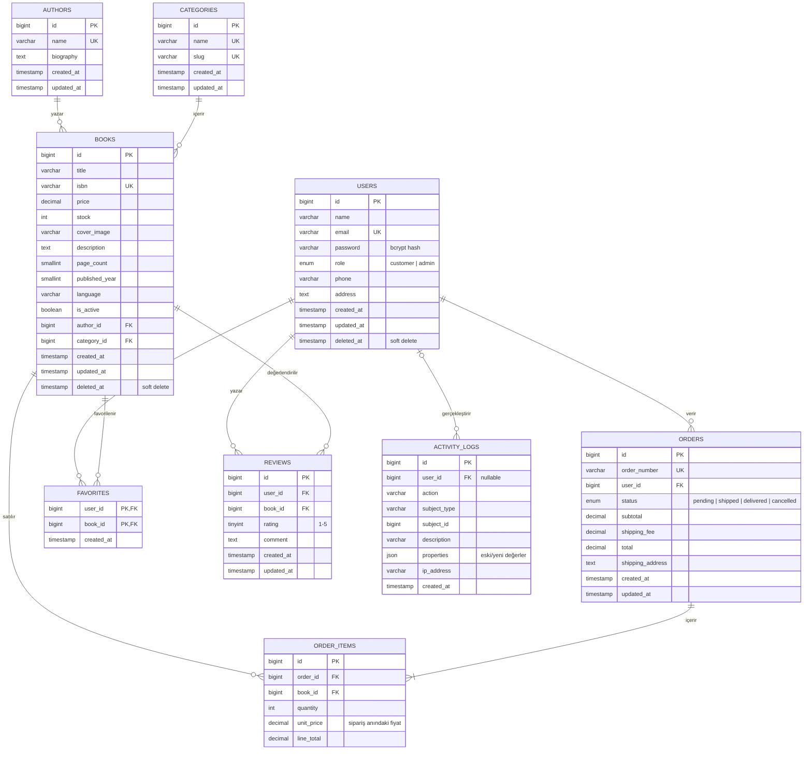

# BookFlow – Veritabanı Mimarisi (MySQL)

Şemanın tek kaynağı `backend/database/migrations` klasörüdür. `docs/schema.sql` bunun MySQL çıktısıdır.

## ER Diyagramı

Ayrıca Laravel Sanctum'un oluşturduğu `personal_access_tokens` tablosu vardır (giriş token'ları, `tokenable_type/tokenable_id` ile kullanıcıya bağlanır).

## Tasarım kararları

| Karar | Gerekçe |
|---|---|
| `users` ve `books` **soft delete** | Silinen kitap/kullanıcı, geçmiş siparişleri bozmaz. |
| `order_items.unit_price` | Kitabın fiyatı sonradan değişse de eski siparişin tutarı sabit kalır. |
| Satış adedi tabloda tutulmaz | `order_items` toplamından hesaplanır; `sold` gibi tutarsız olabilecek kopya alan yoktur. |
| `authors`/`categories` → `books` FK `RESTRICT` | Kitabı olan yazar/kategori silinemez. |
| `orders.status` enum | Akış: pending → shipped → delivered; pending/shipped → cancelled. |
| `activity_logs.user_id` `SET NULL` | Kullanıcı silinse de denetim kaydı korunur. |
| `favorites` bileşik PK, `reviews (user_id, book_id)` unique | Aynı kitap iki kez favorilenemez / iki kez yorumlanamaz. |

## MySQL Workbench'te görüntüleme (macOS)

1. `mysql -u root -p -e "CREATE DATABASE bookflow CHARACTER SET utf8mb4 COLLATE utf8mb4_unicode_ci"`
2. `backend/.env` içinde `DB_*` bilgilerini girin, `cd backend && php artisan migrate`
3. Workbench: **Database → Reverse Engineer…** → `bookflow` şemasını seçin → EER diyagramı oluşur.
   (Alternatif: **File → Run SQL Script…** ile `docs/schema.sql`.)
